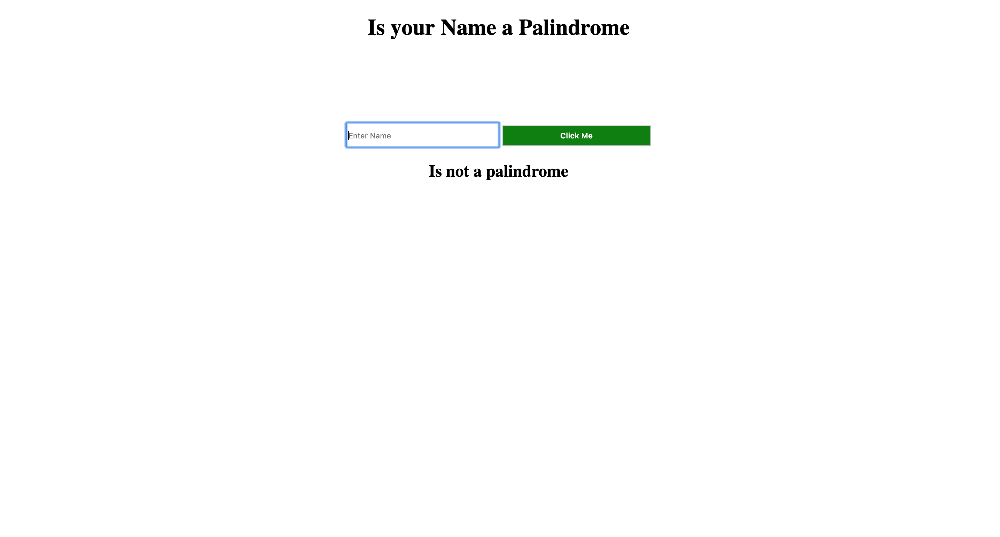

# ↔️ Week08 Bootcamp2019a Project: Server Side Palindrome Checker

### Goal: Create a simple web application that uses the fs and http modules to validate if a string is a palindrome server side.



### lessons learned:
```
I learned my fist idea going into solving a solution might not always be the most efficient solution. I first tried using loops that would loop though the sting values coming from an input and comparing the values. I began to run into to many edge cases that lead to many lines of code. I wasn't till much later on I learned that I could just take the value of the input reverse the sting and compare it against the original value.  Saving me many lines of code.
```
